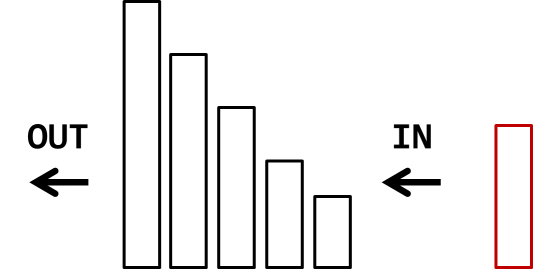
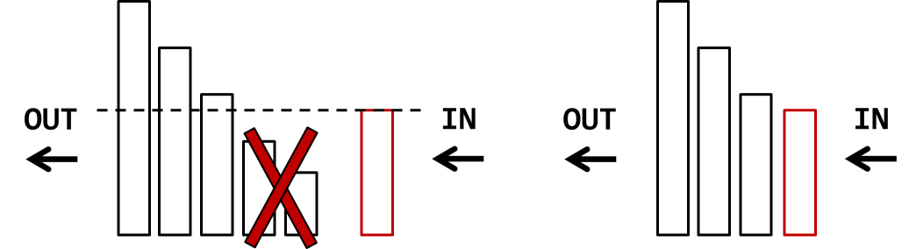

## Monotonic Stack
单调栈保持递增或者递减，一般是O(N)的时间复杂度
模板步骤：
1. 保持栈递增（递减）
2. 利用栈顶元素更新最终结果（或加入）
3. 把当前遍历的元素放入栈（可能是value，或者index）

- 单调栈的一大优势就是线性的时间复杂度，所有的元素只会进栈一次，而且一旦出栈后就不会再进来了
- - 单调递增栈可以找到左起第一个比当前数字小的元素。
  - 单调递减栈可以找到左起第一个比当前数字大的元素。
  - 递增栈是维护递增的顺序，当遇到小于栈顶元素的数就开始处理，而递减栈正好相反，维护递减的顺序，当遇到大于栈顶元素的数开始处理
  - 每个数字只进栈并处理一次，而解决问题的核心就在处理这块，当前数字如果破坏了单调性，就会触发处理栈顶元素的操作

## 单调栈适用情况
- 单调栈何时用： 为任意一个元素找左边和右边第一个比自己大/小的位置，用单调栈
- 用递增单调栈还是递减单调栈：递减栈会剔除波谷，留下波峰；递增栈剔除波峰，留下波谷

## Problems:
- 42 Trapping Rain Water  由于需要知道左右边界的位置，所以我们虽然维护的是递减栈，但是栈中数字并不是存递减的高度，而是递减的高度的坐标。
- 84 Largest Rectangle in Histogram 我们需要按从高板子到低板子的顺序处理，先处理最高的板子，宽度为1，然后再处理旁边矮一些的板子，此时长度为2，因为之前的高板子可组成矮板子的矩形 ，因此我们需要一个递增栈，当遇到大的数字直接进栈，而当遇到小于栈顶元素的数字时，就要取出栈顶元素进行处理了，那取出的顺序就是从高板子到矮板子了，于是乎遇到的较小的数字只是一个触发，表示现在需要开始计算矩形面积了

### tricks:
1. 栈里保存坐标，而不是bar高度值
2. 在栈最左边加dummy index -1简化计算
3. 在高度数组最后面加上一个0，这样原先的最后一个板子也可以被处理了。

## MonoStack vs Mono (De)Que
- Mono Deque

- Mono Stack

https://leetcode.com/discuss/general-discussion/1061744/topic-2-monotonic-stack-or-deque
- when need push/pop from both ends, we need use monotonic deque.
Dual Monotonicity: Value and Expiration time (could be window size (length), or index value (<i-k))
mono deque
  <- [10 7 4] <- 3
expire           new value
              <- 6 (will not insert)
mono stack
     [10 7 4 ] <- 6 (kicks out 4)
           x

We often store array element index into monodeque or monostack, not original value, this allows expiring.

https://www.fatalerrors.org/a/monotone-queue-monotone-stack.html

The monotonicity of monotone queue and monotone stack is in fact monotonicity in structure, and this monotonicity is dual.
The first monotonicity is the monotonicity of values. It is easy to understand that the values of the elements in the structure are arranged in a certain order.
The second monotonicity is the monotonicity of expiration time, which is the key of monotone queue and monotone stack.
Each element is "scheduled" for an expiration time when it is inserted into the structure. This time does not change and is positively correlated with the insertion time.
Add: "positive correlation" means "one more The other one is more ", or if (x)_ i<x_ J \), then (y)_ i<y_ j\).
In order to maintain this dual monotonicity, elements must be deleted in the structure.
Both monotone queue and monotone stack use front opening for insertion and element adjustment. The difference is that monotone queues are deleted with the opening at the back, while monotone stacks are deleted with the front. Let's use a monotone queue for demonstration.
First of all, double monotonicity is maintained in the queue, but the monotonicity will be destroyed when new elements are inserted
The next step is to pop up the element in front of the queue that is not as good as this element, and then insert it:

Common models
Here are some common monotone queue / stack monotone applications.

sliding window
As the name suggests, this is a framed RMQ.

It can be easily solved by using monotone queues.

Maximum / minimum interval sum of limited interval size
This is also a classic application of monotone queues.

After finding the prefix and, for the end of each interval, find an interval beginning with RMQ.

Monotone stack dichotomy
This is a less popular technique. It is often used in the interval query problem where there is no limit at the end and the end needs to be inserted.

For details, please see Maximum number.

## Monotonic Stack

- The typical paradigm for monotonic ascending stack:

[Java]

for(int i = 0; i < A.length; i++){
  while(!stack.isEmpty() && stack.peek() > A){
    stack.pop();
  }
  stack.push(A);
}

###  What can monotonic ascending stack do?
1. find the previous less element of each element in a vector with O(n) time:
    What is the previous less element of an element?
    For example:
    [3, 7, 8, 4]
    The previous less element of 7 is 3.
    The previous less element of 8 is 7.
    The previous less element of 4 is 3.
    There is no previous less element for 3.

    For simplicity of notation, we use abbreviation PLE to denote Previous Less Element.
    Java code (by slightly modifying the paradigm):
    Instead of directly pushing the element itself, here for simplicity, we push the index.
    We do some record when the index is pushed into the stack.
2. find the next less element of each element in a vector with O(n) time:
What is the next less element of an element?
For example:
[3, 7, 8, 4]
The next less element of 8 is 4.
The next less element of 7 is 4.
There is no next less element for 3 and 4.
For simplicity of notation, we use abbreviation NLE to denote Next Less Element.

Java code (by slightly modifying the paradigm):
We do some record when the index is popped out from the stack.

## When should monotonic stack be used?
- When we are trying to find the left and right boundary of a number, the left and right boundary is the first bigger/smaller number on its left/right.
For example:
Suppose we have an array A = {1, 3, 6, 7, 7, 6, 4, 8}, we want to find the 1st smaller number on left and right for each number
We use a non-decreasing monotonic stack. Process the array and we get a stack below.
    7
   7
  6
3
1
Now, we are about to process A[5] = 6, we find that 6 is smaller than the top of the stack, it means A[5] = 6 is the first smaller number than 7. Since the stack is non-decreasing, it means we find the range [4 5) is the range with 7 at the biggest number and A[4] is the 1st number on the left that is <= A[5] and A[5] is the first bigger number that is > A[5].

Then keep popping the stack if the top of the stack < current number. In the end, the stack is below. It means for all the numbers popped, A[5] = 6 is the first smaller number. And now the top of the stack is the 1st number on A[5]’s left that is <= A[5] = 6.
  6
3
1
This is very very important.
- When we are trying to find the left and right boundary of a number, the left and right boundary is the first big/smaller number on its left/right.

## Properties of Monotonic Stack application
- https://code.dennyzhang.com/review-monotone

| Name                                                    | Summary                                                                                             |
|:--------------------------------------------------------|:----------------------------------------------------------------------------------------------------|
| Order of elements in stack                              | monotone                                                                                            |
| Elements remained monotone in stack                     | They indicates undecided elements                                                                   |
| Elements in stack is usually index, instead of objects  |                                                                                                     |
| May not need to store the array of indices              |                                                                                                     |
| Mistake: when pop stack, don’t compare value with index | for len(stack)> 0 and nums[stack[len(stack)-1]] > v VS for len(stack) > 0 and stack[len(stack)-1]>v |
| Initial value of the indices array                      | -1 vs len(nums)                                                                                     |

