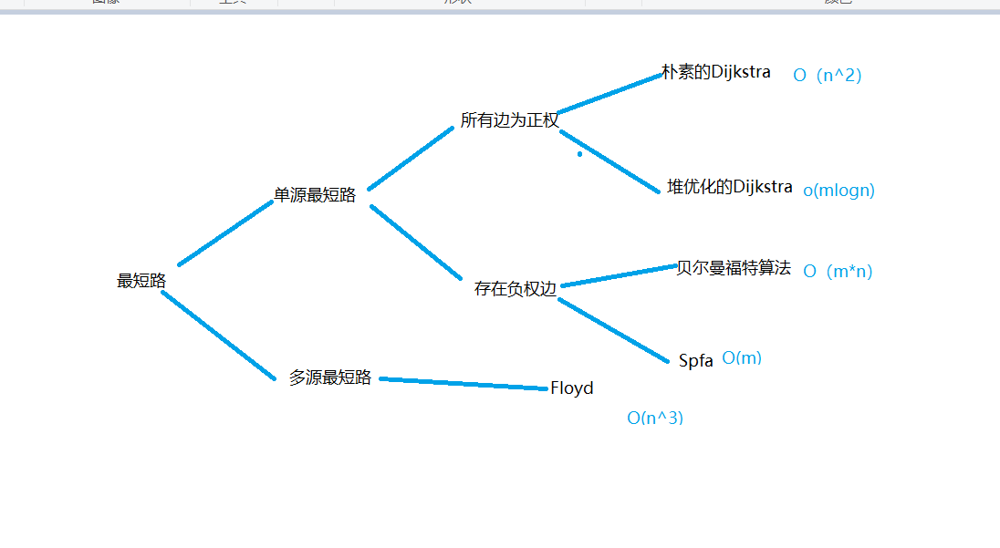

## Shortest Path
[Credit acwing/wuog](https://www.acwing.com/blog/content/462/)

1.dijkstra算法,最经典的单源最短路径算法

2.bellman-ford算法,允许负权边的单源最短路径算法

3.spfa,其实是bellman-ford+队列优化,其实和bfs的关系更密一点

4.floyd算法,经典的多源最短路径算法，可以处理负权

https://www.acwing.com/file_system/file/content/whole/index/content/1336883/

### 单源最短路径 (SSSP) Single Source Shortest Path
- BFS - unweighted (same as Dijkstra's with weight 1 for all edges) FIFO
- Dijkstra(SPF shortest path first) - greedy, no negative weight - priorityqueue stores (cost, node), always visit next node with least cost, and always update cost of neighboring nodes when visiting a node
- Bellman-Ford - can handle negative weight, find shortest path to all other nodes
- SPFA - bellman-ford + PriorityQueue optimization

### 多源最短路径 (MSSP) Multiple-Source Shortest Path
- Floyd–Warshall -- can have negative weight

Graph properties:

    * directed vs undirected
    * weighted vs unweighted
    * cyclic vs acyclic

  unweighted graph                                      => standard BFS search (use standard queue to store vertices to process) time O(V+E)
  positively weighted graph                             => Dijkstra's algorithm (use minheap to store vertices (with costs) to process) time O(V+E)*log(E)
  negative weights and can have negative weighted cycles => Bellman Ford's algorithm

#### Simple BFS for unweighted graph

For simple graph without weight (or equal weight), simple BFS search with recording the previous node and steps to current node will find shortest path with the first result.

https://www.hackerearth.com/practice/algorithms/graphs/shortest-path-algorithms/tutorial/

#### Dijkstra's Algorithm
Dijkstra's algorithm has many variants but the most common one is to find the shortest paths from the source vertex to all other vertices in the graph.

Algorithm Steps:

    *) Set all vertices distances = infinity except for the source vertex, set the source distance = .
    *) Push the source vertex in a min-priority queue in the form (distance , vertex), as the comparison in the min-priority queue will be according to vertices distances.
    *) Pop the vertex with the minimum distance from the priority queue (at first the popped vertex = source).
    *) Update the distances of the connected vertices to the popped vertex in case of "current vertex distance + edge weight < next vertex distance", then push the vertex
    *) with the new distance to the priority queue.
    *) If the popped vertex is visited before, just continue without using it.
    *) Apply the same algorithm again until the priority queue is empty.

    Pseudo code:
        adj_list = collections.defaultdict(list)
        for t in costs: # costs is (start node, end node, cost)
            adj_list[t[0].append((t[1], t[2]))

        q = [(initial cost=0, start node)]  # cost to the starting node, and the starting node
        heapq.heapify(q)

        costs = dict()
        while q:
            cost, cur = heapq.heappop(q) # always pick the node with smallest overall cost to this node
            if cur in dist: continue
            costs[cur] = cost
            for nei, nei_cost in adj_list[cur]:
                if nei not in dist:
                    heapq.heappush(q, (cost + nei_cost, nei))

        return max(costs.values()) if len(costs) == n else -1

time complexity is O(V^2)
time compleicty with min heap queue O(V+E*log(V)

#### Bellman Ford's Algorithm
- 适用情况：
--   从A出发是否存在到达各个节点的路径(有计算出值当然就可以到达)；
--   从A出发到达各个节点最短路径(时间最少、或者路径最少等)
--   图中是否存在负环路（权重之和为负数）
思路：
1.初始化时将起点s到各个顶点v的距离dist(s->v)赋值为INF，dist(s->s)赋值为0
2.后续进行最多n-1次遍历操作,对所有的边进行松弛操作,假设:
 所谓的松弛，以边ab为例，若dist(a)代表起点s到达a点所需要花费的总数，dist(b)代表起点s到达b点所需要花费的总数,weight(ab)代表边ab的权重，
 若存在:三角不等式：
 (dist(a) +weight(ab)) < dist(b)则说明存在到b的更短的路径,s->...->a->b,更新b点的总花费为(dist(a) +weight(ab))，父节点为a
3.遍历都结束后，若再进行一次遍历，还能得到s到某些节点更短的路径的话，则说明存在负环路

Bellman Ford's algorithm is used to find the shortest paths from the source vertex to all other vertices in a weighted graph. It depends on the following concept: Shortest path contains at most  edges, because the shortest path couldn't have a cycle.

Algorithm Steps:

    *) The outer loop traverses from  : .
    *) Loop over all edges, check if the next node distance > current node distance + edge weight, in this case update the next node distance to "current node distance + edge weight".

time complexity O(V*E)

function BellmanFord(list vertices, list edges, vertex source) is

    // This implementation takes in a graph, represented as
    // lists of vertices (represented as integers [0..n-1]) and edges,
    // and fills two arrays (distance and predecessor) holding
    // the shortest path from the source to each vertex

    distance := list of size n
    predecessor := list of size n

    // Step 1: initialize graph
    for each vertex v in vertices do
        distance[v] := inf             // Initialize the distance to all vertices to infinity
        predecessor[v] := null         // And having a null predecessor
    
    distance[source] := 0              // The distance from the source to itself is, of course, zero

    // Step 2: relax edges repeatedly
    repeat |V|−1 times:
        for each edge (u, v) with weight w in edges do
            if distance[u] + w < distance[v] then
                distance[v] := distance[u] + w
                predecessor[v] := u

    // Step 3: check for negative-weight cycles
    for each edge (u, v) with weight w in edges do
        if distance[u] + w < distance[v] then
            error "Graph contains a negative-weight cycle"

    return distance, predecessor

#### SPFA
我们用数组dis记录每个结点的最短路径估计值，用邻接表或邻接矩阵来存储图G。我们采取的方法是动态逼近法：设立一个先进先出的队列用来保存待优化的结点，优化时每次取出队首结点u，并且用u点当前的最短路径估计值对离开u点所指向的结点v进行松弛操作，如果v点的最短路径估计值有所调整，且v点不在当前的队列中，就将v点放入队尾。这样不断从队列中取出结点来进行松弛操作，直至队列空为止，所以他的时间复杂度就是O(m),最坏O(n*m)!

#### Floyd Warshall's Algorithm (all-pairs shortest path algorithm)
Floyd算法本质上是DP
Floyd Warshall's Algorithm is used to find the shortest paths between between all pairs of vertices in a graph, where each edge in the graph has a weight which is positive or negative. The biggest advantage of using this algorithm is that all the shortest distances between any 2 vertices could be calculated in O(V^3), where V is the number of vertices in a graph.

Floyd Warshall's Algorithm Steps:

For a graph with N vertices:

*) Initialize the shortest paths between any 2 vertices with Infinity.
*) Find all pair shortest paths that use 0 intermediate vertices, then find the shortest paths that use 1 intermediate vertex and so on.. until using all N vertices as intermediate nodes.
*) Minimize the shortest paths between any 2 pairs in the previous operation.
*) For any 2 vertices (i,j) , one should actually minimize the distances between this pair using the first K nodes, so the shortest path will be:
    min(dist[i][k] + dist[k][j], dist[i][j])
    dist[i][k] represents the shortest path that only uses the first K vertices, dist[k][j] represents the shortest path between the pair k,j. As the shortest path will be a concatenation of the shortest path from i to k, then from k to j. .

    for(int k = 1; k <= n; k++){
        for(int i = 1; i <= n; i++){
            for(int j = 1; j <= n; j++){
                dist[i][j] = min( dist[i][j], dist[i][k] + dist[k][j] );
            }
        }
    }

Time Complexity of Floyd Warshall's Algorithm is O(V^3), where  is the number of vertices in a graph.

### Dijkstra's vs Floyd for shortest path
https://www.geeksforgeeks.org/comparison-dijkstras-floyd-warshall-algorithms/

|                 | BFS                                                           | Dijkstra                                              | Floyd-Warshall (DP)                    | Bellman Ford's                                                                               |
|:----------------|:--------------------------------------------------------------|:------------------------------------------------------|:---------------------------------------|:---------------------------------------------------------------------------------------------|
| idea            | visit nodes level by level based on the closest to the source | in each step, visit the node with the lowest cost     |                                        |                                                                                              |
| 适用            | 无权重有向图从搜索出源点到终点的步骤最少的路径                    | 有权重的方向图中搜索出最短路径，但不适合于有负权重的情况. |                                        | 存在负权重的方向图中(没有负权重也可以用，但是效率比Dijkstra低很多)，搜索出源点到各个节点的最短路径 |
| 环              | 标志好已处理的节点避免进入死循环，可以支持                       | 同BFS，标志好已处理的节点避免进入死循环，可以支持        |                                        |                                                                                              |
| 负环            | 不能检测负环路                                                 | 不能检测负环路                                         |                                        | 可以判断出图是否存在负环路，存在负环路的情况下不支持计算出各个节点的最短路径                      |
| scope           | SSSP                                                          | SSSP (single source)                                  | All pairs                              | SSSP                                                                                         |
| queue type      | simple deque                                                  | priority queue                                        |                                        |                                                                                              |
| negative weight | no weight or equal weight                                     | positive weight only                                  | negative weight but not negative cycle | negative weight or negative cycle                                                            |
| time complexity | O(V+E)                                                        | O(V + ElogV)                                          | O(V^3)                                 | O(VE)                                                                                        |

#### A* Algorithm
Dijkstra can be thought as a subset of A*. For Dijkstra the heuristic = 0
A* is a BFS with customized priority for selecting a node to expand; the priority is to select the lowest f()=heuristic()+cost()

### Note
1. dijkstra -> no weight or weight=1 -> BFS
2. Bellman-Ford vs Dijskstra
Bellman-Ford 每次都是从源点s重新出发进行”松弛”更新操作
Dijskstra 从源点出发向外扩逐个处理相邻的节点，不会去重复处理节点
