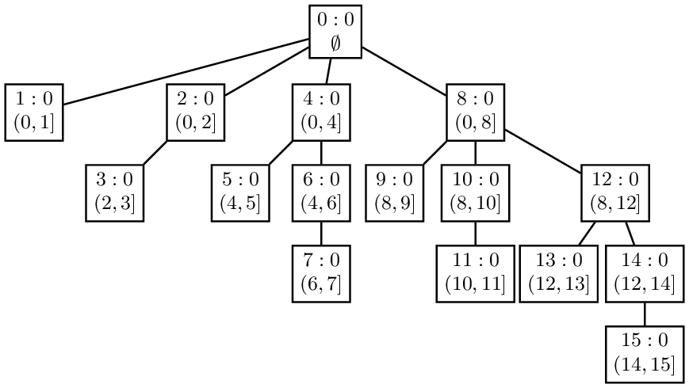

# Tree

## Lowest Common Ancestor
Recursive/DFS
1. start traversing the tree from root
2. if current node is p or q, return current node, else we search both left and right child tree
3. if either left or right subtree search returns some result (not None), that means at least one of p or q is in that subtree
4. if both left and right subtree returns node, that means p and q are in different subtree, so the current node is the LCA
5. if only one side returns a node, that would be the LCA

## 树状数组 Binary Index Tree (Fenwick Tree) vs 线段树 ST (Segment Tree)
* BIT stores element sum, but ST stores element value
* BIT handles range sum, but ST handles not just range sum, also range max / min
* if range size change, cannot use BIT or ST
* There are things that a segment tree can do but a BIT cannot : A BIT essentially works with cumulative quantities. When the cumulative quantity for interval [i..j] is required, it is found as the difference between cumulative quantities for [1...j] and [1...i-1]. This works only because addition has an inverse operation. You cannot do this if the operation is non-invertible (such as max). On the other hand, every interval on a segment tree can be found as union of disjoint intervals and no inverse operation is required
* A BIT requires only half as much memory as a segment tree : In cases where you have masochistic memory constraints, you are almost stuck with using a BIT
* Though BIT and segment tree operations are both O(log(n)), the segment tree operations have a larger constant factor : This should not matter for most cases. But once again, if you have masochistic time constraints, you might want to switch from a segment tree to a BIT. The constant factor might become more of a problem if the BIT/Segment tree is multidimensional.
* what problem is more suitable for Fenwick tree - sum, but not min or max, since sum is invertible operation (addition, multiplication), but min/max/gcd are not
* Segment trees are used to answer queries about properties of subarrays of a given array, when elements might be updated. Here are two sample problems:
  - Given two indices i and j, what is the sum of the subarray from index i to index j?
  - Given two indices i and j, what is the minimum of all the values between index i and index j?
  - The one incontrovertible advantage is that a BIT will always use less memory than a segment tree. This is because a BIT only uses N array elements whereas a segment tree always uses at least 2N.

|             | BIT                                              | Segment Tree                                                |
|:------------|:-------------------------------------------------|:------------------------------------------------------------|
| query       | O(logN)                                          | O(logN)                                                     |
| preprocess  | O(Nlog(N))                                       | O(N)                                                        |
| online      | yes, can append data, and still work             | size fixed at beginning                                     |
| range query | sum only                                         | sum, min, max                                               |
| pros        | good time complexity                             | good time complexity                                        |
| cons        | only query sum, not applicable to many problems. | complicate code. large memory usage (large constant factor) |


* In a Fenwick tree, a certain cell is responsible for other cells as well. The position of the first non-zero bit from right in the binary representation of the index of the cell determines the range of responsibility of that cell below itself. Let’s call this position RSB(rightmost set bit). Also, note that the positions from the right are one-based. The range of responsibility is 2^(RSB - 1).

```
                 0
	/		     |              \
0001(1) 0010(2)  0100(4)         1000(8)
[1,1]   [1,2]    [1,4]           [1,8]
            |      |    \           |             \
        0011(3)  0101(5) 0110(6) 1001(9) 1010(10) 1100(12)
        [3,3]    [5,5]   [5,6]   [9,9]   [9,10]   [9,12]
		                  |               |        |       \
			    		 0111(7)         1011(11) 1101(13) 1110(14)
						 [7,7]           [11,11]  [13,13]  [13,14]
						                                    |
						    							   1111(15)
						 								   [15,15]
```
update:
	i += lowbit(i), i<=n
query => presum(0, i):
	i -= lowbit(i), i>0

### When to use BIT Fenwick Tree vs Segment Tree
https://www.quora.com/How-does-one-decide-when-to-use-a-Segment-Tree-or-Fenwick-Tree
Here are the things to keep in mind while deciding whether to use segment tree or binary indexed tree:

- Anything that can be done using a BIT can also be done using a segment tree : BIT stores cumulative quantities for certain intervals. Segment tree stores cumulative quantities for those intervals and more. In particular, if we are creating a data structure to deal with an array of size N=2^K, the BIT will have cumulative quantities for N intervals whereas the segment tree will have cumulative values for 2N-1 intervals
- There are things that a segment tree can do but a BIT cannot : A BIT essentially works with cumulative quantities. When the cumulative quantity for interval [i..j] is required, it is found as the difference between cumulative quantities for [1...j] and [1...i-1]. This works only because addition has an inverse operation. You cannot do this if the operation is non-invertible (such as max). On the other hand, every interval on a segment tree can be found as union of disjoint intervals and no inverse operation is required
- A BIT requires only half as much memory as a segment tree : In cases where you have masochistic memory constraints, you are almost stuck with using a BIT
- Though BIT and segment tree operations are both O(log(n)), the segment tree operations have a larger constant factor : This should not matter for most cases. But once again, if you have masochistic time constraints, you might want to switch from a segment tree to a BIT. The constant factor might become more of a problem if the BIT/Segment tree is multidimensional.
- With practice, coding either will be very fast : If you have coded a segment tree 100 times, you will get it very fast the next time you do it. So no need to worry about code being long.
